# Autômatos
Nesse tópico será retratado os autômatos da linguagem Sloth. Os autômatoss são simbolos não-terminais da liguagem.

### Programa
Autômato raiz chamado primeiro pelo analisador sintático.

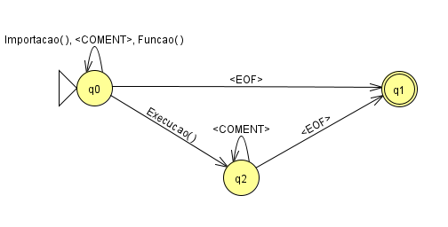

Expressão formal:

```
(Importacao()|<COMENT>|Funcao())*
[Execucao()]
(<COMENT>)*
<EOF>
```

### Funcao

Autômato para criação de funções.

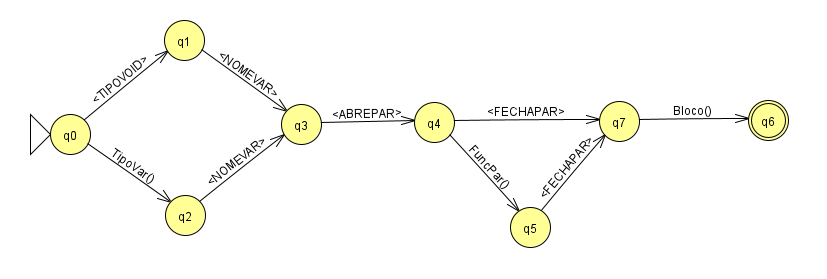

Expressão formal:

```
(<TIPOVOID>|TipoVar())
<NOMEVAR>
<ABREPAR>
[FuncPar()]
<FECHAPAR>
Bloco()
```

### FuncPar
Autômato para criar parâmetros para as funções.

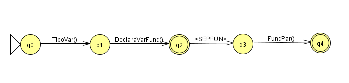

Expressão formal:

```
TipoVar()
DeclaraVarFunc()
[(<SEPFUN>)FuncPar()]
```

### DeclaraVarFunc
Autômato para criar variáveis dos parâmetros das funções, vetores não podem ter valor nas chaves.

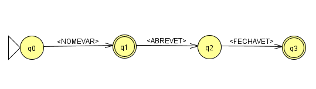

Expressão formal:

```
(<NOMEVAR>)
[(<ABREVET>)(<FECHAVET>)]

```

### Retorno
Autômato para criar o retorno das funções.

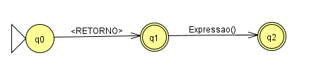

Expressão formal:

```
(<RETORNO>)
[Expressao()]
```

### ChamaFuncao
Autômato para chamar funções.

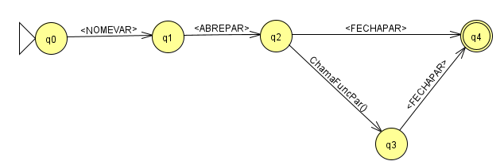

Expressão formal:

```
(<NOMEVAR>)
(<ABREPAR>)
[ChamaFuncPar()]
(<FECHAPAR>)
```

### ChamaFuncPar
Autômato para chamar parâmetros para funções.

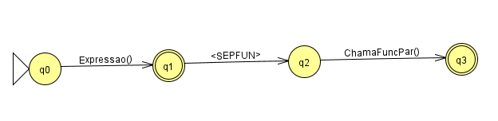

Expressão formal:

```
(Expressao())
[(<SEPFUN>)ChamaFuncPar()]
```

### Importacao
Autômato para criar importações.

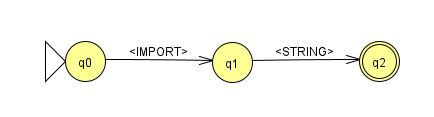

Expressão formal:

```
(<IMPORT>)
(<STRING>)
```

### Execucao
Autômato da classe principal.

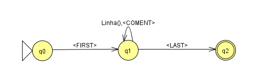

Expressão formal:

```
(<FIRST>)
(Linha()|(<COMENT>))*
(<LAST>)
```

### Linha
Autômato que faz a maior parte funcional da linguagem.

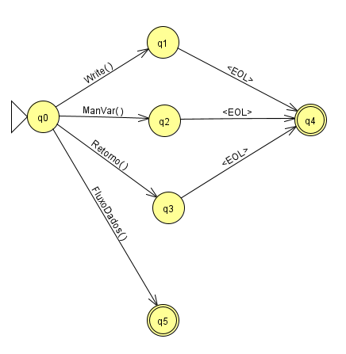

Expressão formal:

```
((Write()|ManVar()|Retorno())(<EOL>))
| FluxoDados()
```

### Write
Autômato para escrita no terminal.

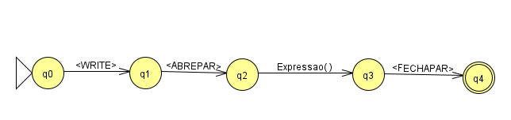

Expressão formal:

```
(<WRITE>)
(<ABREPAR>)
(Expressao())
(<FECHAPAR>)	
```

### ManVar
Autômato para criação e/ou atribuição de variável.

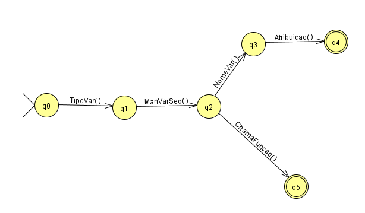

Expressão formal:

```
(TipoVar()ManVarSeq())
| (NomeVar()Atribuica())
| ChamaFuncao()
```

### ManVarSeq
Autômato para declarar várias variáveis na mesma linha.

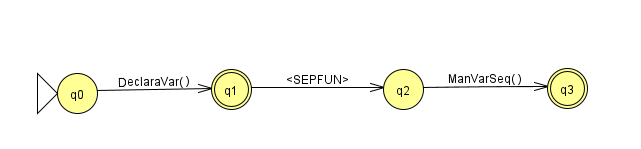

Expressão formal:

```
DeclaraVar()
[(<SEPFUN>)ManVarSeq(b)]
```

### TipoVar
Autômato para tipos de variáveis.

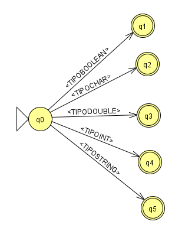

Expressão formal:

```
<TIPOBOOLEAN>
| <TIPOCHAR>
| <TIPODOUBLE>
| <TIPOINT>
| <TIPOSTRING>
```

### DeclaraVar
Autômato para declarar variáveis.

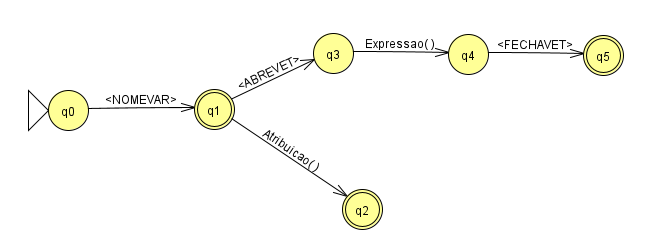

Expressão formal:

```
(<NOMEVAR>)
[((<ABREVET>)
(Expressao())
(<FECHAVET>))
| (Atribuicao())]
```

### NomeVar
Autômato para nome de variáveis.

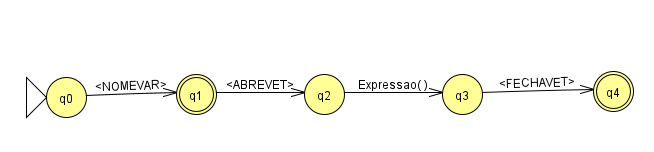

Expressão formal:

```
(<NOMEVAR>)
[(<ABREVET>)
(Expressao())
(<FECHAVET>)]
```

### Atribuicao
Autômato para atribuição.

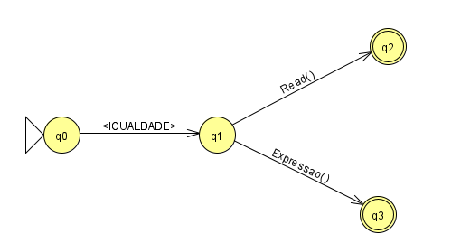

Expressão formal:

```
(<IGUALDADE>)
(Read()|Expressao())
```

### Read
Autômato para leitura do terminal.

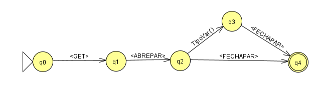

Expressão formal:

```
(<GET>) 
(<ABREPAR>) 
[TipoVar()]
(<FECHAPAR>)
```

### Expressao
Autômato para criação de expressões, podendo ter numero negativo no começo.

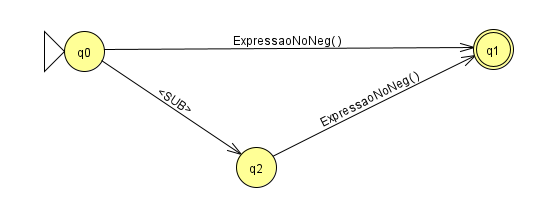

Expressão formal:

```
[<SUB>]ExpressaoNoNeg()
```

### ExpressaoNoNeg
Autômato para criação de expressões, não podendo ter numero negativo no começo.

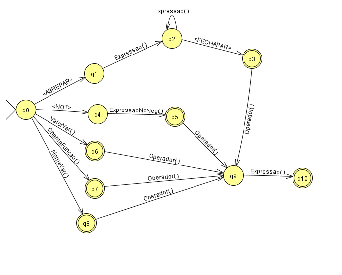

Expressão formal:

```
(((<ABREPAR>)(Expressao())+(<FECHAPAR>))
| (<NOT>)ExpressaoNoNeg()
| ValorVar()
| ChamaFuncao()
| NomeVar())
[Operador()Expressao()]
```

### Operador
Autômato para chamar operadores.

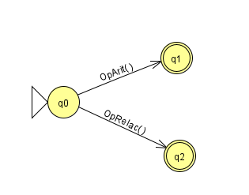

Expressão formal:

```
OpArit()|OpRelac()
```

### OpAtir
Autômato para chamar as operações aritméticas.

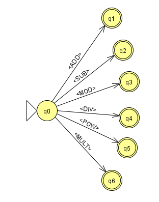

Expressão formal:

```
(<ADD>)
| (<SUB>)
| (<MOD>)
| (<DIV>)
| (<POW>)
| (<MULT>)
```

### OpRelac
Autômato para chamar as operações relacionais.

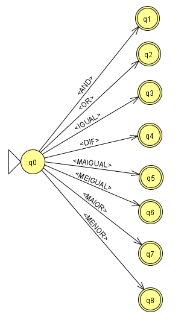

Expressão formal:

```
(<AND>)
| (<OR>)
| (<IGUAL>)
| (<DIF>)
| (<MAIGUAL>)
| (<MEIGUAL>)
| (<MAIOR>)
| (<MENOR>)
```

### ValorVar
Autômato para valores literais.

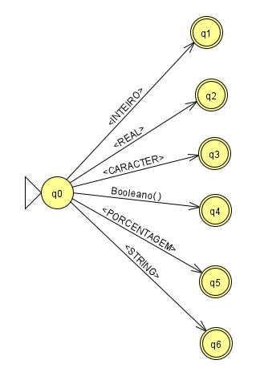

Expressão formal:

```
(<INTEIRO>)
| (<REAL>)
| (<CARACTER>)
| (Booleano())
| (<PORCENTAGEM>)
| (<STRING>)
```

### Booleano
Autômato para tipos booleanos literais.

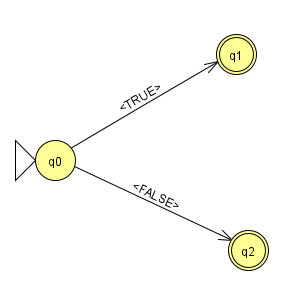

Expressão formal:

```
(<TRUE>)
| (<FALSE>)
```

### FluxoDados
Autômato para fluxo de dados.

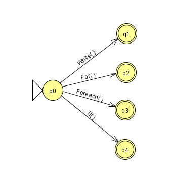

Expressão formal:

```
While()
| For()
| Foreach()
| If()

```

### While
Autômato para o fluxo de dados while.

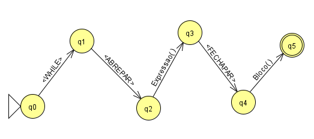

Expressão formal:

```
(<WHILE>)
(<ABREPAR>)
Expressao()
(<FECHAPAR>)
Bloco()
```

### For
Autômato para o fluxo de dados for.

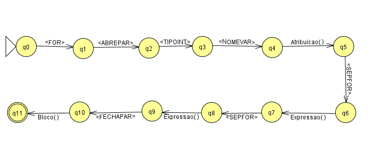

Expressão formal:

```
(<FOR>)
(<ABREPAR>)
(<TIPOINT>)
(<NOMEVAR>)
Atribuicao()
(<SEPFOR>)
Expressao()
(<SEPFOR>)
Expressao()
(<FECHAPAR>)
Bloco()
```

### Foreach
Autômato para o fluxo de dados foreach.


Expressão formal:

```
(<FOREACH>)
(<ABREPAR>)
(<NOMEVAR>)
(<SEPFOR>)
(<NOMEVAR>)
(<FECHAPAR>)
Bloco()
```

### If
Autômato para o fluxo de dados if.

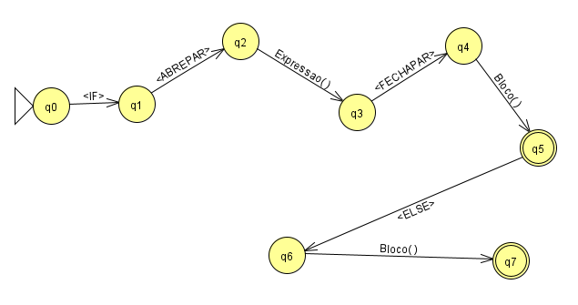

Expressão formal:

```
(<IF>)
(<ABREPAR>)
Expressao()
(<FECHAPAR>)
Bloco()
[(<ELSE>)Bloco()]
```

### Bloco
Autômato para abertura de blocos.

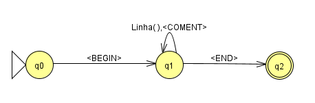

Expressão formal:

```
(<BEGIN>)
(Linha()|(<COMENT>))*
(<END>)
```