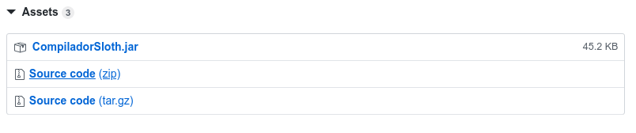

# Instalar pelo código-fonte

Existem dois caminhos para compilar diretamente pelo código-fonte. O primeiro caminho é compilar desde o arquivo `.jj`, o qual é o arquivo lido pelo compilador JavaCC, essa compilação gerará várias classes Java. Essas classes Java já estão compiladas nos arquivos-fonte, então caso não tenha nescessidade de compilar o arquivo do JavaCC novamente a segunda maneira é ignorar a compilação do arquivo do JavaCC e ir direto para a compilação das classes javas e confiar que os arquivos nos arquivos-fonte estão corretos.

Para os diferentes tipos de instalação é nescessário ter um [JDK](https://openjdk.java.net/) instalado.

## Compilação desde o arquivo do JavaCC
<a href="#posJCC">pular</a>

O Compilador Sloth foi produzida utilizando JavaCC, sua instalação é necessária para a criação dos arquivos base.
Os passos para a instalação da ferramenta em linux e em windows são apresentados a seguir.

### Windows

O download pode ser feito acessando o site oficial da ferramenta:
[JavaCC](https://javacc.org/download)

É recomendado utilizar a versão 5.0, pois esta foi testada durante a realização do projeto e se apresenta estável.
Após o download da ferramenta é necessário realizar a extração dos arquivos contidos na pasta zip. Recomenda-se armazenar a pasta do Javacc no meus documentos.
Para que seja possível a utilização do javacc através de linha de comando no cmd do windows é necessário adicionar o local da pasta do JavaCC no path do sistema seguindo os seguintes passos:

1. Abra o painel de controle
2. Clique em "Sistema e Segurança"
3. Em seguida selecione a opção "Sistema"
4. No campo a esquerda procure por "Configurações avançadas do sistema"
5. Na aba "Avançado", clique em "Variaveis de Ambiente"
6. No campo "Variveis do sistema", procure pela variável PATH.
7. Clique no botão "editar". (OBSERVAÇÂO: DE MANEIRA ALGUMA CLIQUE NO BOTAO EXCLUIR!!!)
8. Copie ou digite o endereço da pasta \bin contida no diretório do JAVACC, clique em aplicar/ok. 
9. Teste a execução correta dos comandos abrindo o cmd e digitando a linha "javacc"

Para a compilação dos arquivos gerados é necessario também a instalação do Java.
Instalando o jdk em windows:
Faça o download do arquivo através do [site](https://www.oracle.com/technetwork/pt/java/javase/downloads/jdk-netbeans-jsp-3413153-ptb.html), é necessário realizar o cadastro ou se identificar utilizando uma conta da Oracle.
Também é necessario adcionar o caminho da pasta bin do jdk no path do sistema para que seja possível compilar os arquivos através do prompt de comando. 

### Linux
Para fazer a instalação do javacc em linux basta utilizar as seguintes linhas de comando. 

- Distribuições baseadas em Debian:
```
$ sudo apt-get install javacc
```

- Distribuições baseadas em ArchLinux:
```
$ sudo yay -S javacc
```

<a id="posJCC"></a>
## Download dos arquivos referentes ao compilador Sloth

Existem várias maneiras de se fazer o download do código-fonte do projeto.

1. Baixando da pagina do [projeto](https://github.com/wykke/CompiladorSloth) no Github. Basta apertar o grade botão verde `Clone ou Download` e fazer download do arquivo Zip.
2. Baixando através de uma ferramenta git utilizando o comando:
```
$ git clone https://github.com/wykke/CompiladorSloth
```
3. Baixando o código-fonte estável de uma [Realese](https://github.com/wykke/CompiladorSloth/releases), basta selecionar `Source code (zip)`, nos assets. 



## Compilando o código-fonte

### Utilizando Node.JS com npm
Caso tenha [node.js](https://nodejs.org/en/) e [npm](https://www.npmjs.com/) instalados no computador, existem alguns comandos que podem fascilitar a compilação, porem precisam do JavaCC instalado.
- Para buildar o projeto desde o JavaCC e executar um arquivo testes:
```
$ npm run buildTest
```
- Para apenas rodar o arquivo de testes:
```
$ npm run runTest
```
- Para buildar um arquivo `.jar` na pasta `./compilador/bin/`:
```
$ npm run buildJar
```

### Sem a utilização do Node.JS

Com um terminal aberto no caminho da pasta do projeto, se o seu objetivo é compilar o arquivo JavaCC antes, basta utilizar o comando:

```
$ cd ./compilador/codigo
$ javacc ../CompiladorSloth.jj
```

O JavaCC gerará várias classes Java na pasta `./compilador/codigo/`, as quais ja estavam lá caso não tenha modificado o arquivo `Compiladosloth.jj`.

Para compilar os arquivos Java, caso ainda não tenha utilizado, entre no diretório dos códigos:

```
$ cd ./compilador/codigo
```

Em seguida, para compilar os arquivos Java basta utilizar:

```
$ javac *.java
```

A partir desse ponto ja é possivel utilizar o Compilador Sloth, mas caso queira ter um arquivo `.jar` utilize:

```
$ jar -cfe ../bin/CompiladorSloth.jar CompiladorSloth *.class
```

Ele criará o arquivo `.jar` na pasta `./compilador/bin/`.

## Utilização
### Caso tenha criado o arquivo jar
Para utilizar o Compilador Sloth basta utilizar o comando em um terminal:

```
$ java -jar ./compilador/bin/CompiladorSloth.jar input output
```

Sendo que `./compilador/bin/CompiladorSloth.jar` é o caminho relativo até o diretório do arquivo `.jar` do compilador, servindo também para `input` e `output`. Todos os parâmetros são necessários.

### Caso não tenha criado o arquivo Jar
Para utilizar o Compilador Sloth basta utilizar o comando em um terminal:

```
$ java ./compilador/codigo/CompiladorSloth.java input output
```
Sendo que `./compilador/codigo/CompiladorSloth.jar` é o caminho relativo até o diretório do arquivo `.java` do compilador, servindo também para `input` e `output`. Todos os parâmetros são necessários.